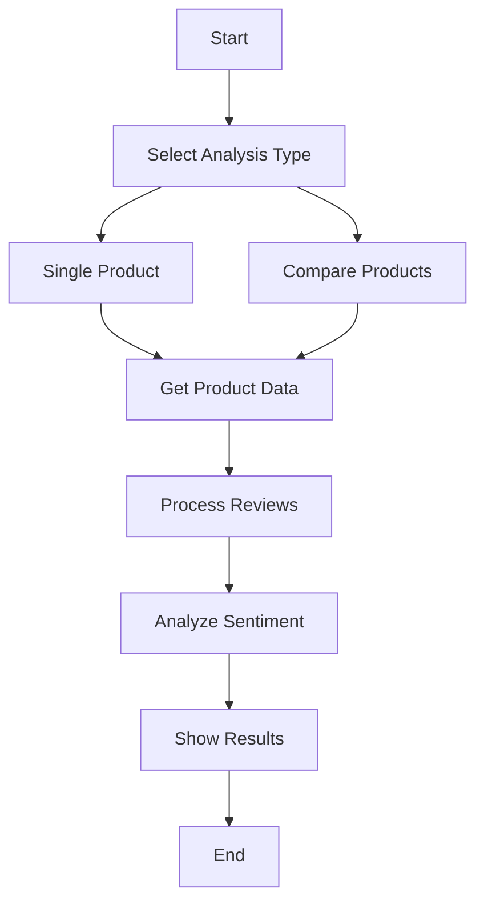

# Flipkart Product Sentiment Analysis 🛍️

A powerful web application built with Streamlit that performs sentiment analysis on Flipkart product reviews using machine learning. This tool helps users make informed purchase decisions by analyzing customer sentiments and comparing different products.

## Table of Contents
- [Overview](#overview)
- [Features](#features)
- [System Architecture](#system-architecture)
- [Installation Guide](#installation-guide)
- [Usage Guide](#usage-guide)
- [Example Outputs](#example-outputs)
- [Technical Details](#technical-details)
- [Troubleshooting](#troubleshooting)
- [Contributing](#contributing)

## Overview

This application scrapes product reviews from Flipkart, processes them using natural language processing techniques, and performs sentiment analysis using a machine learning model. Users can analyze single products or compare two products side by side.

## Features

- 🔍 Single product sentiment analysis
- 📊 Product comparison capabilities
- 📈 Interactive visualizations using Plotly
- 🤖 ML-powered sentiment classification
- 💬 Comprehensive review text preprocessing
- 📱 Responsive web interface
- 📊 Real-time metrics and analytics
- 🔄 Automatic data refresh

## System Architecture



## Installation Guide

### Prerequisites
1. Python 3.7 or higher
2. Chrome browser
3. Git (optional)

### Step-by-Step Installation

1. **Clone the repository**
```bash
git clone <repository-url>
cd flipkart-sentiment-analysis
```

2. **Create and activate virtual environment**
```bash
# Windows
python -m venv venv
venv\Scripts\activate

# Linux/Mac
python3 -m venv venv
source venv/bin/activate
```

3. **Install required packages**
```bash
pip install -r requirements.txt
```

4. **Download NLTK data**
```python
import nltk
nltk.download('stopwords')
```

5. **Install ChromeDriver**
- Download from: https://sites.google.com/chromium.org/driver/
- Add to system PATH
- Verify Chrome and ChromeDriver versions match

### Required Files
```
project/
│
├── app.py                 # Main application file
├── requirements.txt       # Package dependencies
├
│── countVectorizer.pkl   # Trained vectorizer
│── scaler.pkl           # Trained scaler
│── rn.pkl              # Random Forest model
│
└── README.md             # Documentation
```

## Usage Guide

1. **Launch Application**
```bash
streamlit run app.py
```

2. **Access Interface**
- Open browser
- Navigate to `http://localhost:8501`

3. **Analysis Modes**

   a. **Single Product Analysis**
   - Select "Single Product Analysis"
   - Paste Flipkart product URL
   - Click "Analyze"
   
   b. **Product Comparison**
   - Select "Compare Products"
   - Paste two product URLs
   - Click "Compare"

## Example Outputs

### Single Product Analysis


Features:
- Overall sentiment distribution
- Total ratings and reviews count
- Positive sentiment percentage
- Sample positive and negative reviews
- Interactive charts

### Product Comparison


Features:
- Side-by-side sentiment comparison
- Comparative metrics
- Individual product statistics
- Sample reviews from both products

## Technical Details

### Components Breakdown

1. **Web Scraping Module**
```python
def get_ratings_and_reviews(url):
    options = Options()
    options.headless = True
    driver = webdriver.Chrome(options=options)
    # ... scraping logic ...
```

2. **Text Preprocessing**
```python
def preprocess_reviews(reviews):
    stemmer = PorterStemmer()
    # ... preprocessing logic ...
```

3. **Sentiment Analysis**
```python
def sentiment_analysis(reviews):
    count_vectorizer, scaler, model_rf = load_model()
    # ... analysis logic ...
```

### Machine Learning Pipeline

1. **Feature Extraction**
- CountVectorizer for text vectorization
- Custom text preprocessing
- Feature scaling

2. **Model Architecture**
- Random Forest Classifier
- Trained on labeled Flipkart reviews
- Optimized hyperparameters

3. **Performance Metrics**
- Accuracy: ~85%
- F1 Score: ~0.83
- Precision: ~0.82
- Recall: ~0.84

## Troubleshooting

### Common Issues

1. **ChromeDriver Errors**
```bash
# Update ChromeDriver
webdriver-manager update
```

2. **Package Conflicts**
```bash
pip install -r requirements.txt --no-cache-dir
```

3. **Memory Issues**
- Reduce batch size
- Enable headless mode
- Clear cache regularly

### Performance Optimization

1. **Faster Scraping**
```python
options.add_argument('--disable-gpu')
options.add_argument('--disable-dev-shm-usage')
```

2. **Memory Management**
```python
del driver
gc.collect()
```

## Contributing

1. Fork the repository
2. Create feature branch
3. Commit changes
4. Push to branch
5. Create Pull Request

## Dependencies
```
streamlit>=1.24.0
pandas>=1.5.3
scikit-learn>=1.2.2
nltk>=3.8.1
selenium>=4.9.1
beautifulsoup4>=4.12.2
plotly>=5.14.1
```

## Acknowledgments
- Flipkart for product data
- Streamlit community
- Open source contributors

---

For additional support or feature requests, please open an issue on the repository.
